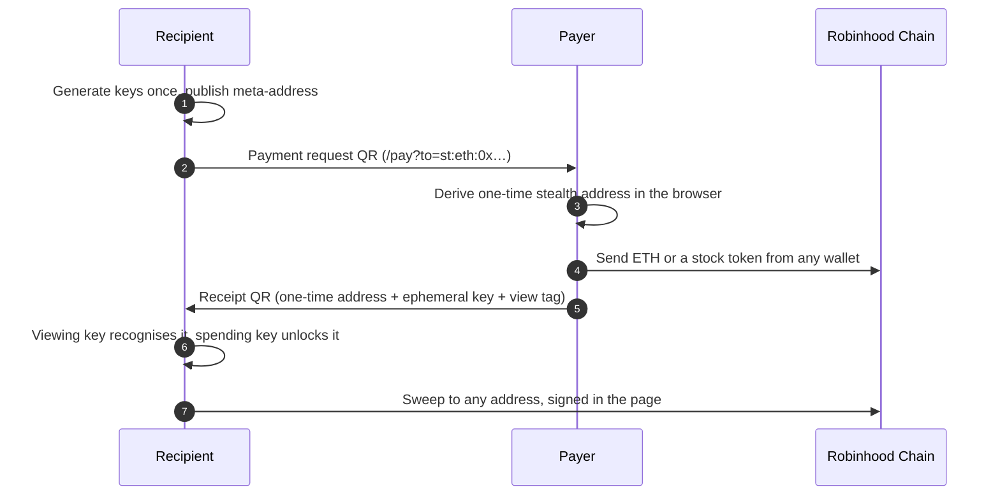

<div align="center">


# RhMask

**The privacy layer for tokenized stocks on Robinhood Chain.**

> Wall Street sees everything. **RhMask sees nothing.**

[](https://rhmask.org)
[](https://robinhoodchain.blockscout.com)
[](https://eips.ethereum.org/EIPS/eip-5564)
[](https://github.com/rh-mask/rhmask/actions)
[](LICENSE)

[**Open the app**](https://rhmask.org/app) · [Pay privately](https://rhmask.org/pay) · [Product](docs/PRODUCT.md) · [Plan](docs/PLAN.md) · [Tokenomics](docs/TOKENOMICS.md) · [Extension](docs/EXTENSION.md)

</div>

---

Tokenized stocks put the market on a public ledger. Every entry, every exit, every balance is readable by anyone with an explorer. RhMask gives holders three things: a way to **receive unseen**, a way to **trade unseen**, and a vault that **pays stakers in real stock tokens**.

Two surfaces, same core functions: the **web app** (this repository) and a **browser extension** that drops a fresh stealth address into any address field on any site.

## ✦ Surfaces

| Surface | What it does | State |
|:--|:--|:--:|
| **Ghost Receive** | One meta-address, a fresh unlinkable address per payment. ERC-5564 stealth addresses derived in the browser, keys encrypted at rest. | `beta` |
| **Private Pay** | Request a payment as a QR, pay to a one-time address from any wallet, hand back a receipt QR, claim and sweep. Three scans, zero servers. | `beta` |
| **Mask Swap** | Private fills instead of public order books. Venue name and flat fee printed before you send. Non-custodial. | `beta · dry quotes` |
| **Blue Chip Vault** | Stake `$MASK`; protocol revenue buys a basket of stock tokens and streams it to stakers. | `planned` |
| **Proof Ledger** | Every payout listed with its transaction hash. If it is not on the ledger, it did not happen. | `planned` |

> **Honest status.** Anything marked `planned` has no on-chain effect yet. Nothing on the site is estimated or back-filled. The live status table is on the landing page.

## ✦ Private Pay in three scans



Nothing in this flow touches a server. The receipt QR carries the ERC-5564 announcement until the announcer contract ships, and the format maps one-to-one onto the on-chain event so the scanner can replace the QR without a format change.

## ✦ Verified on mainnet

`npm run check:onchain` runs read-only against Robinhood Chain and simulates from real holders. Nothing is signed or broadcast.

| Check | Result |
|:--|:--|
| Stock token registry | 10 live ERC-20s, symbols and decimals match, all issuer-owned upgradeable proxies |
| Stealth receive | A fresh one-time address receives NVDA, SPY, TSLA, AAPL, MSFT in simulation |
| Vault feasibility | Every basket token transfers to a contract address, `approve` works, nothing paused |
| Sweep error path | An empty stealth address fails cleanly, and the UI says why in a sentence |

<details>
<summary><b>What is hidden, what is not</b></summary>

**Hidden:** the link between you and a receiving address (stealth addresses); your order from public order books and mempools as a visible swap.

**Not hidden:** on-chain settlement itself; the venue filling an order sees the deposit and the receiving address; network-level metadata (your IP to the RPC) unless you use your own node.

We say this on every screen where it matters. Never "anonymous", never "untraceable".

</details>

## ✦ Stack

| Layer | Choice | Why |
|:--|:--|:--|
| Framework | Next.js 16, React 19, Tailwind v4 | Route handlers for the small server side, static landing, one deploy |
| Chain access | viem | Typed, tree-shakeable, no wallet SDK, no telemetry |
| Stealth crypto | `@noble/curves` + `@noble/hashes` | Audited pure-JS secp256k1 and keccak, runs in the browser |
| Key storage | WebCrypto PBKDF2-SHA256 + AES-256-GCM | Encrypted at rest, decrypted only in memory |
| QR | `qrcode` (SVG) + native `BarcodeDetector` with `jsqr` fallback | Renders on the first frame, scans on every browser |
| Wallet | EIP-1193 injected provider | No account linkage, no third-party connect modal |
| Hosting | Vercel | `/api/rpc` pass-through keeps the app working where the chain's RPC domain is blocked |

## ✦ Getting started

```bash
npm install
cp .env.example .env.local   # fill in what you have
npm run dev
```

The app runs with no keys at all. Routes that need a key return a `503` naming the exact env var.

| Variable | Scope | Purpose |
|:--|:--:|:--|
| `NEXT_PUBLIC_APP_URL` | public | Canonical URL for metadata and QR links |
| `NEXT_PUBLIC_RHC_RPC_URL` | public | Override the browser RPC (default: same-origin `/api/rpc`) |
| `ROUTER_JWT` | server | Intent router partner key; enables live quotes |
| `ROUTER_FEE_RECIPIENT` | server | Address that receives the routing fee |
| `ROUTER_FEE_BPS` | server | Routing fee in basis points (default 30) |
| `ALCHEMY_API_KEY` | server | Production RPC |

`NEXT_PUBLIC_*` values are inlined into the browser bundle. Never put a secret behind that prefix.

### Checks

| Command | What it proves |
|:--|:--|
| `npm run check` | Everything below plus the production build. This is the pre-push gate and the CI job. |
| `npm run check:fast` | Same without the build |
| `npm run check:stealth` | ERC-5564 round-trip: derive, recognise, recover, and a stranger cannot |
| `npm run check:payment` | Private Pay request and receipt formats round-trip, bad input is rejected |
| `npm run check:onchain` | Read-only mainnet check: tokens, stealth receive, vault feasibility, sweep errors |
| `npm run hooks:install` | Installs the git `pre-push` hook once per clone |

## ✦ Project layout

```
rhmask/
├─ src/
│  ├─ app/
│  │  ├─ page.tsx            landing with the honest status table
│  │  ├─ app/                dashboard · Swap · Receive · Pay · Vault
│  │  ├─ pay/                landing for a scanned payment-request QR
│  │  ├─ opengraph-image.tsx social card, rendered at build time
│  │  └─ api/
│  │     ├─ health · chain · tokens · vault
│  │     ├─ quote            POST private-fill quote
│  │     ├─ order/[id]       GET settlement status
│  │     └─ rpc              POST JSON-RPC pass-through (allow-listed)
│  ├─ components/            PayCard · ClaimCard · StealthCard · SwapCard · VaultCard · QrCode · QrScanner
│  ├─ hooks/useWallet.ts     EIP-1193, no SDK
│  └─ lib/
│     ├─ stealth.ts          ERC-5564 derivation and recognition
│     ├─ payment.ts          request and receipt wire formats
│     ├─ keystore.ts         local key store, passphrase encryption
│     ├─ transfer.ts         wallet transfers, balances, pre-flight, sweep
│     ├─ qr.ts               QR generation and decoding
│     ├─ chain.ts · tokens.ts · env.ts · router/
├─ scripts/                  stealth-check · payment-check · onchain-check · prepush-check · install-hooks
├─ contracts/                Solidity specs (vault, announcer, revenue router)
├─ docs/                     product · plan · extension · architecture · tokenomics · roadmap · push rules
└─ marketing/                narrative and launch copy
```

## ✦ API

| Method | Path | Notes |
|:--:|:--|:--|
| `GET` | `/api/health` | liveness |
| `GET` | `/api/chain` | chain params, live block number, RPC error if any |
| `GET` | `/api/tokens` | stock token registry |
| `GET` | `/api/router-tokens` | assets the intent router can fill, cached 10 minutes, feeds the swap picker |
| `POST` | `/api/quote` | `{ originAsset, destinationAsset, amount, recipient, refundTo, slippageBps?, dry? }` |
| `GET` | `/api/order/:depositAddress` | order status |
| `GET` | `/api/vault` | totals, basket, payouts (all zero until the vault ships) |
| `POST` | `/api/rpc` | JSON-RPC pass-through: read methods and `eth_sendRawTransaction`, batches capped, log ranges bounded |

## ✦ Network

| | |
|:--|:--|
| Chain | Robinhood Chain, id `4663` (Arbitrum Orbit L2) |
| RPC | `https://rpc.mainnet.chain.robinhood.com` (public, rate-limited) |
| Explorer | `https://robinhoodchain.blockscout.com` |
| Stock tokens | 18-decimal ERC-20s, issuer-owned beacon proxies; addresses in `src/lib/tokens.ts`, re-verify before wiring value |

## ✦ Contributing

Read [`docs/PUSH_RULES.md`](docs/PUSH_RULES.md) first. In short:

- Every push passes `npm run check`, locally through the hook and again in CI.
- One change per commit, imperative subject, no trailers of any kind.
- Human contributors only. Public text is scanned for foreign brands and attribution words before it leaves the machine.
- Nothing private is ever tracked: `internal/`, `.env*`, keys.

## ✦ Deploy

Vercel, framework preset Next.js, region `sin1` (see [`vercel.json`](vercel.json)). Canonical domain **rhmask.org**: point `A rhmask.org 76.76.21.21` and `CNAME www cname.vercel-dns.com` at the registrar, then set `NEXT_PUBLIC_APP_URL=https://rhmask.org`. Redeploy with `vercel deploy --prod` from a linked checkout. No database is required.

## ✦ License

MIT. RhMask is non-custodial software. It does not hold funds, does not provide investment advice, and does not guarantee execution, rates, or settlement times. Stock tokens are issued by a third party and may be unavailable in your jurisdiction.
